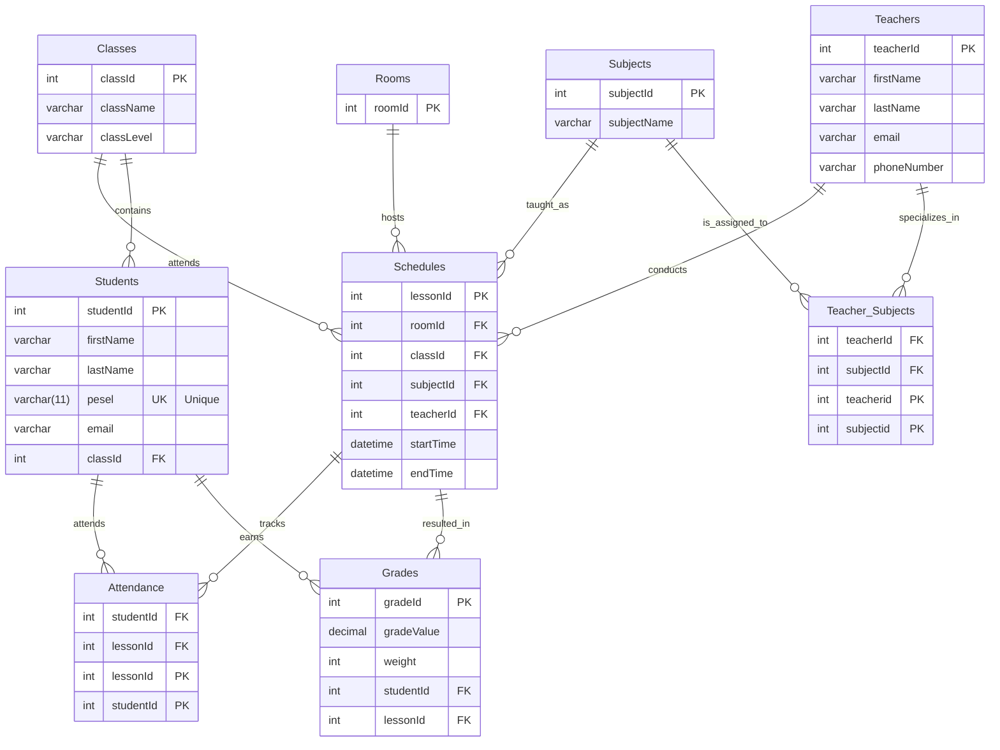

# 🏫 System Zarządzania Szkołą "Lumina"

**Autorzy:** Bohdan Kliukovskyi, Bohdan Krasovskyi  
**Data projektu:** 2026-05-14  
**Status:** Dokumentacja Techniczna (Zadanie 1,2,3)

---

## 1. Opis Systemu
**Lumina** to zintegrowany system bazy danych służący do automatyzacji procesów administracyjnych i dydaktycznych. System opiera się na relacyjnym modelu danych, który łączy ewidencję osób (uczniów i nauczycieli) z logistyką zajęć (plan lekcji, sale) oraz wynikami nauczania.

---

## 2. Architektura Danych (Struktura Tabel)

Na podstawie diagramu ERD, system składa się z następujących kluczowych komponentów:

### 👤 Zarządzanie Osobami
* **Students**: Przechowuje dane uczniów. Kluczowym elementem jest unikalny numer **PESEL** oraz przypisanie do konkretnej klasy (`classId`).
* **Teachers**: Ewidencja kadry pedagogicznej (imię, nazwisko, email, numer telefonu).
* **Classes**: Definiuje grupy uczniów (nazwa klasy i poziom, np. "1A", "Liceum").

### 📚 Program Nauczania i Logistyka
* **Subjects**: Katalog przedmiotów nauczanych w szkole.
* **Teacher_Subjects**: Tabela łącząca, realizująca relację wiele-do-wielu (jeden nauczyciel może uczyć wielu przedmiotów, a jeden przedmiot może być prowadzony przez wielu nauczycieli).
* **Rooms**: Wykaz sal lekcyjnych, w których odbywają się zajęcia.

### 📅 Proces Dydaktyczny
* **Schedules**: Centralna tabela systemu. Łączy nauczyciela, klasę, przedmiot i salę w konkretnym czasie (`startTime`, `endTime`).
* **Attendance**: Moduł śledzenia obecności uczniów na konkretnych lekcjach.
* **Grades**: Ewidencja ocen uczniów. Każda ocena jest powiązana z konkretnym uczniem oraz jednostką lekcyjną (`lessonId`), co pozwala określić jej wagę i wartość.

---

## 3. Wymagania i Integralność Systemu

System implementuje szereg reguł biznesowych zapewniających spójność danych:

1.  **Integralność Tożsamości**: Tabela `Students` wymusza unikalność pola `pesel` (Unique Key), uniemożliwiając dublowanie rekordów.
2.  **Spójność Relacyjna**: Wykorzystanie kluczy obcych (FK) gwarantuje, że np. ocena nie może zostać wystawiona nieistniejącemu uczniowi, a lekcja nie może odbyć się bez przypisanego przedmiotu.
3.  **Logistyka Zajęć**: Tabela `Schedules` pozwala na precyzyjne zarządzanie czasem pracy szkoły, unikając nakładania się terminów dla klas i nauczycieli.
4.  **Wielopoziomowość**: Dzięki tabeli `Teacher_Subjects`, system elastycznie zarządza specjalizacjami kadry.

---

## 4. Historyjki Użytkownika (User Stories)

| Rola | Potrzeba (Cel) | Powiązane Tabele |
| :--- | :--- | :--- |
| **Uczeń** | Chcę sprawdzić w jakiej sali i z jakim nauczycielem mam lekcję o danej godzinie. | `Schedules`, `Rooms`, `Teachers` |
| **Nauczyciel** | Chcę wystawić ocenę uczniowi za konkretną lekcję i określić jej wagę. | `Grades`, `Students`, `Schedules` |
| **Wychowawca** | Chcę zobaczyć listę wszystkich uczniów przypisanych do mojej klasy. | `Classes`, `Students` |
| **Dyrektor** | Chcę sprawdzić, jakie przedmioty są przypisane do danego nauczyciela. | `Teachers`, `Teacher_Subjects`, `Subjects` |
| **Administrator** | Chcę dodać nową salę lekcyjną do systemu, aby móc planować w niej zajęcia. | `Rooms` |

---

## 5. Kluczowe Relacje (Techniczne)

* **One-to-Many (1:N)**: 
    * `Classes` -> `Students` (Jedna klasa ma wielu uczniów).
    * `Schedules` -> `Grades` (Z jednej lekcji może wynikać wiele ocen).
* **Many-to-Many (M:N)**:
    * `Teachers` <-> `Subjects` (poprzez `Teacher_Subjects`).
    * `Students` <-> `Schedules` (poprzez `Attendance`).



# Opis poszczególnych tabel

---

# Tabela: Classes
## Przechowuje informacje o oddziałach szkolnych, w tym ich nazwę (np. "10-A") oraz poziom edukacji.

| Nazwa atrybutu | Typ | Opis/Uwagi |
| :--- | :--- | :--- |
| **classId** | INT | Klucz główny (PK), unikalny identyfikator klasy. |
| **className** | VARCHAR(255) | Nazwa oddziału (np. "10-A"). |
| **classLevel** | VARCHAR(255) | Poziom edukacji przypisany do klasy. |

```sql
CREATE TABLE Classes (
    classId INT PRIMARY KEY,
    className VARCHAR(255),
    classLevel VARCHAR(255)
);
```
---

# Tabela: Subjects
## Przechowuje listę przedmiotów nauczania (np. matematyka, biologia.
```sql
CREATE TABLE Subjects (
    subjectId INT PRIMARY KEY,
    subjectName VARCHAR(255)
);
```

---

# Tabela: Rooms
## Zawiera identyfikatory fizycznych sal, w których odbywają się zajęcia.

| Nazwa atrybutu | Typ | Opis/Uwagi |
| :--- | :--- | :--- |
| **roomId** | INT | Klucz główny (PK), unikalny numer/identyfikator sali. |

```sql
CREATE TABLE Rooms (
    roomId INT PRIMARY KEY
);
```

---

# Tabela: Teachers
## Zawiera dane osobowe (imię, nazwisko) oraz informacje kontaktowe (e-mail, numer telefonu) nauczycieli.

| Nazwa atrybutu | Typ | Opis/Uwagi |
| :--- | :--- | :--- |
| **teacherId** | INT | Klucz główny (PK), unikalny identyfikator nauczyciela. |
| **firstName** | VARCHAR(255) | Imię nauczyciela. |
| **lastName** | VARCHAR(255) | Nazwisko nauczyciela. |
| **email** | VARCHAR(255) | Służbowy adres e-mail. |
| **phoneNumber** | VARCHAR(50) | Numer telefonu kontaktowego. |

```sql
CREATE TABLE Teachers (
    teacherId INT PRIMARY KEY,
    firstName VARCHAR(255),
    lastName VARCHAR(255),
    email VARCHAR(255),
    phoneNumber VARCHAR(50)
);
```
---


# Tabela: Students
## Przechowuje dane uczniów, w tym unikalny numer PESEL, adres e-mail oraz przypisanie do konkretnej klasy (klucz obcy classId).

| Nazwa atrybutu | Typ | Opis/Uwagi |
| :--- | :--- | :--- |
| **studentId** | INT | Klucz główny (PK), unikalny identyfikator ucznia. |
| **firstName** | VARCHAR(255) | Imię ucznia. |
| **lastName** | VARCHAR(255) | Nazwisko ucznia. |
| **pesel** | VARCHAR(11) | Unikalny numer PESEL (UNIQUE). |
| **email** | VARCHAR(255) | Adres e-mail ucznia. |
| **classId** | INT | Klucz obcy (FK), odniesienie do tabeli Classes. |

```sql
CREATE TABLE Students (
    studentId INT PRIMARY KEY,
    firstName VARCHAR(255),
    lastName VARCHAR(255),
    pesel VARCHAR(11) UNIQUE,
    email VARCHAR(255),
    classId INT,
    FOREIGN KEY (classId) REFERENCES Classes(classId)
);
```

---

# Tabela: Teacher_Subjects
## Tabela łącząca (relacyjna), która określa, jakich przedmiotów może uczyć dany nauczyciel.

| Nazwa atrybutu | Typ | Opis/Uwagi |
| :--- | :--- | :--- |
| **teacherId** | INT | Klucz obcy (FK), identyfikator nauczyciela. |
| **subjectId** | INT | Klucz obcy (FK), identyfikator przedmiotu. |

```sql
CREATE TABLE Teacher_Subjects (
    teacherId INT,
    subjectId INT,
    PRIMARY KEY (teacherId, subjectId),
    FOREIGN KEY (teacherId) REFERENCES Teachers(teacherId),
    FOREIGN KEY (subjectId) REFERENCES Subjects(subjectId)
);
```
---


# Tabela: Schedules
## Główna tabela organizacyjna. Łączy konkretną lekcję z salą, klasą, przedmiotem, nauczycielem oraz dokładnym czasem rozpoczęcia i zakończenia.

| Nazwa atrybutu | Typ | Opis/Uwagi |
| :--- | :--- | :--- |
| **lessonId** | INT | Klucz główny (PK), identyfikator jednostki lekcyjnej. |
| **roomId** | INT | Klucz obcy (FK), powiązanie z salą. |
| **classId** | INT | Klucz obcy (FK), powiązanie z klasą. |
| **subjectId** | INT | Klucz obcy (FK), powiązanie z przedmiotem. |
| **teacherId** | INT | Klucz obcy (FK), powiązanie z nauczycielem. |
| **startTime** | DATETIME | Data i godzina rozpoczęcia lekcji. |
| **endTime** | DATETIME | Data i godzina zakończenia lekcji. |

```sql
CREATE TABLE Schedules (
    lessonId INT PRIMARY KEY,
    roomId INT,
    classId INT,
    subjectId INT,
    teacherId INT,
    startTime DATETIME,
    endTime DATETIME,
    FOREIGN KEY (roomId) REFERENCES Rooms(roomId),
    FOREIGN KEY (classId) REFERENCES Classes(classId),
    FOREIGN KEY (subjectId) REFERENCES Subjects(subjectId),
    FOREIGN KEY (teacherId) REFERENCES Teachers(teacherId)
);
```

---

# Tabela: Grades
## Przechowuje informacje o ocenach uzyskanych przez uczniów na konkretnych lekcjach, uwzględniając wartość oceny i jej wagę.

| Nazwa atrybutu | Typ | Opis/Uwagi |
| :--- | :--- | :--- |
| **gradeId** | INT | Klucz główny (PK), identyfikator oceny. |
| **gradeValue** | DECIMAL(5,2) | Wartość oceny (np. 5.00). |
| **weight** | INT | Waga oceny (wpływ na średnią). |
| **studentId** | INT | Klucz obcy (FK), powiązanie z uczniem. |
| **lessonId** | INT | Klucz obcy (FK), powiązanie z konkretną lekcją. |

```sql
CREATE TABLE Grades (
    gradeId INT PRIMARY KEY,
    gradeValue DECIMAL(5,2),
    weight INT,
    studentId INT,
    lessonId INT,
    FOREIGN KEY (studentId) REFERENCES Students(studentId),
    FOREIGN KEY (lessonId) REFERENCES Schedules(lessonId)
);
```

---

# Tabela: Attendance
## Tabela relacyjna rejestrująca, czy dany uczeń był obecny na konkretnej lekcji.

| Nazwa atrybutu | Typ | Opis/Uwagi |
| :--- | :--- | :--- |
| **studentId** | INT | Klucz obcy (FK), identyfikator ucznia. |
| **lessonId** | INT | Klucz obcy (FK), identyfikator lekcji. |

```sql
CREATE TABLE Attendance (
    studentId INT,
    lessonId INT,
    PRIMARY KEY (studentId, lessonId),
    FOREIGN KEY (studentId) REFERENCES Students(studentId),
    FOREIGN KEY (lessonId) REFERENCES Schedules(lessonId)
);
```
 
